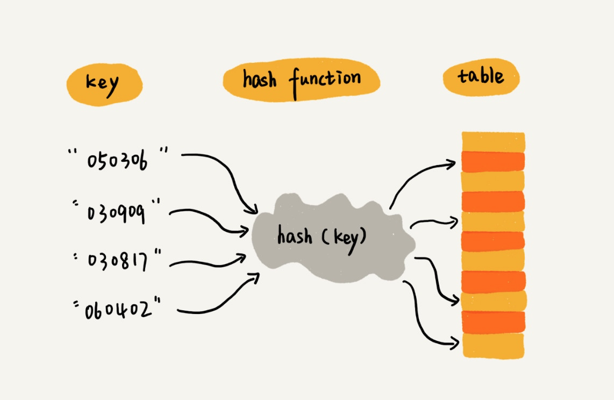

# 概述

散列表（HashTable，也叫哈希表），是根据键（Key）直接访问在内存存储位置的数据结构。

其实现原理是：通过散列函数（也叫哈希函数）将元素的键映射为数组下标（转化后的值叫做散列值或哈希值），然后在对应下标位置存储记录值。当我们按照键值查询元素时，就是用同样的散列函数，将键值转化数组下标，从对应的数组下标的位置取数据：

散列表用的是数组支持按照下标随机访问数据的特性，所以散列表其实就是数组的一种扩展，由数组演化而来。可以说，如果没有数组，就没有散列表。而 PHP 的关联数组干脆就是基于散列表实现。

散列技术既是一种存储方法，也是一种查找方法。与之前的查找方法不同的是散列技术的记录之间不存在逻辑关系，因此主要是面向查找的数据结构。最适合求解的问题是查找给定值相等的记录。

散列表中有两个关键的概念，一个是散列函数（或者哈希函数），一个是散列冲突（或者哈希冲突）。

散列函数用于将键值经过处理后转化为散列值。具有以下特性：

- 散列函数计算得到的散列值是非负整数
- 如果 key1 == key2，则 hash(key1) == hash(key2)
- 如果 key1 != key2，则 hash(key1) != hash(key2)

所谓散列冲突，简单来说，指的是 key1 != key2 的情况下，通过散列函数处理，hash(key1) == hash(key2)，这个时候，我们说发生了散列冲突。设计再好的散列函数也无法避免散列冲突，原因是散列值是非负整数，总量是有限的，但是现实世界中要处理的键值是无限的，将无限的数据映射到有限的集合，肯定避免不了冲突。

事实上，如果不考虑散列冲突，散列表的查找效率是非常高的，时间复杂度是 O(1)，比二分查找效率还要高，但是因为无法避免散列冲突，所以散列表查找的时间复杂度取决于散列冲突，最坏的情况可能是 O(n)，退化为顺序查找。这种情况在散列函数设计不合理的情况下更糟。
