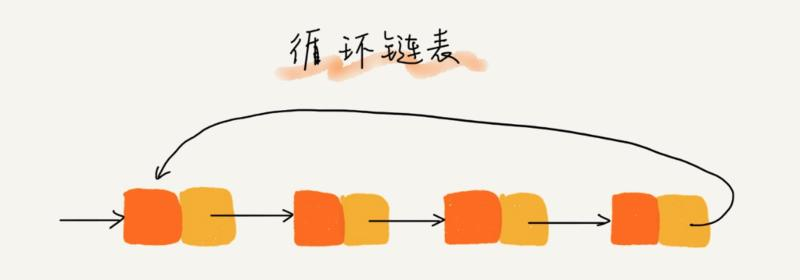
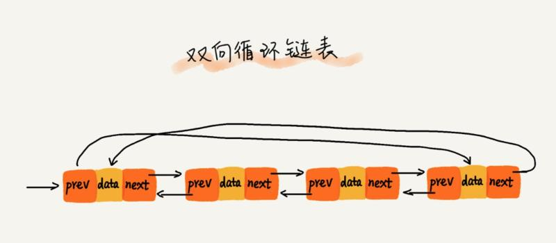

# 链表

与数组不同，链表不需要一块连续的内存空间，它通过“指针”将一组零散的内存块链接起来用。

## 单链表

链表有多种类型，最简单的是单链表，单链表是最原生的链表，其结构如下图所示：

单链表中有两个节点比较特殊，分别是第一个结点和最后一个结点。我们通常把第一个结点叫作头结点，把最后一个结点叫作尾结点。其中，头结点用来记录链表的基地址，有了它，我们就可以遍历得到整条链表。而尾结点特殊的地方是：指针不是指向下一个结点，而是指向一个空地址 null，表示这是链表上最后一个结点。对单链表而言，理论上来说，插入和删除节点的时间复杂度是 O(1)，查询节点的时间复杂度是 O(n)。

## 循环链表

单链表的基础上扩展还有循环链表，循环链表和单链表的区别是尾节点指向了头结点，从而首尾相连，有点像贪吃蛇，可用于解决「约瑟夫环」问题，循环链表的结构如图所示：

## 双向链表

此外，还有比较常见的双向链表，其结构如下图所示：

顾名思义，与单链表的区别是双向链表除了有一个指向下一个节点的指针外，还有一个用于指向上一个节点的指针，从而实现通过 O(1) 复杂度找到上一个节点。正是因为这个节点，使得双向链表在插入、删除节点时比单链表更高效，虽然我们前面已经提到单链表插入、删除时间复杂度已经是 O(1) 了，但是这没有考虑还只是针对插入、删除操作本身而言，以删除为例，删除某个节点后，需要将其前驱节点的指针指向被删除节点的下一个节点，这样，我们还需要获取其前驱节点，在单链表中获取前驱节点的时间复杂度是 O(n)，所以综合来看单链表的删除、插入操作时间复杂度也是 O(n)，而双向链表则不然，它有一个指针指向上一个节点，所以其插入和删除时间复杂度才是真正的 O(1)。

此外，对于有序链表而言，双向链表的查询效率显然也要高于单链表，不过更优的时间复杂度是靠更差的空间复杂度换取的，双向链表始终需要单链表的两倍空间，但是正如我们之前说的，在 Web 应用中，时间效率优先级更高，所以我们通常都是空间换时间来提高性能，Java 的 LinkedHashMap 底层就用到了双向链表。

## 循环双向链表

结合循环链表和双向链表为一体的双向循环链表，其结构如下图所示：

其实就是将双向链表的首尾通过指针连接起来。
