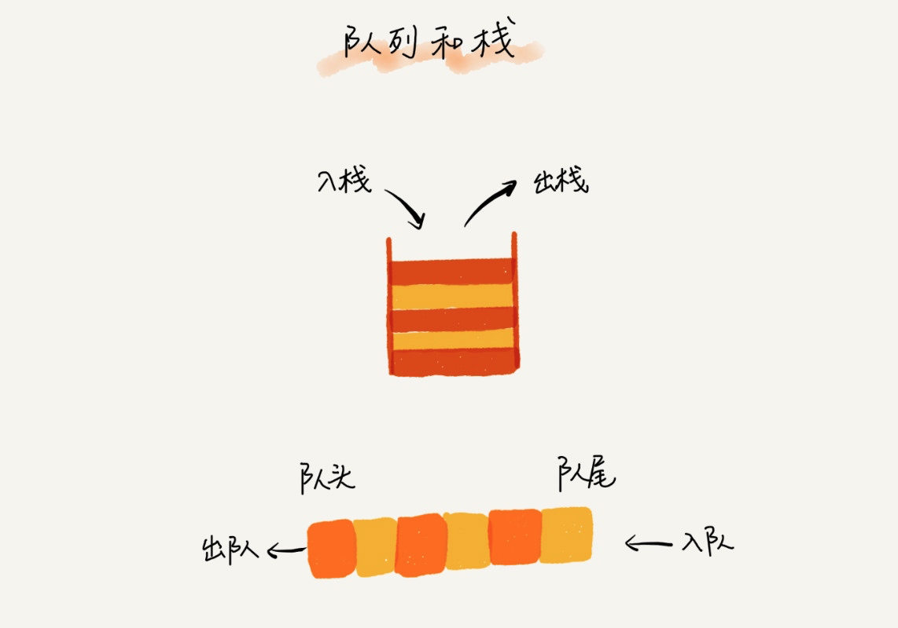
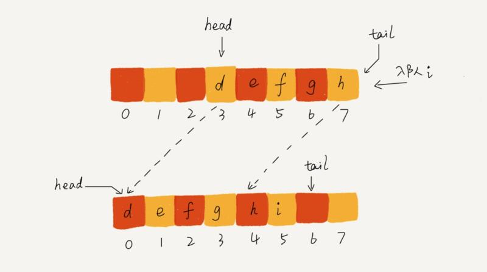
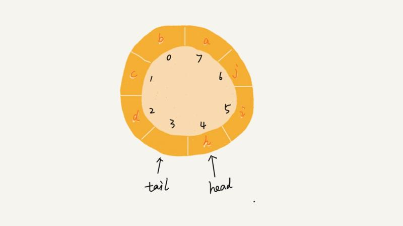

# 特殊的线性结构：队列

队列，和栈一样，队列也是一中特殊的线性表结构，只不过队列是在一端插入，另一端删除，就跟我们平常排队一样的道理，从队尾入队，在队头出去，所以队列的特性是先入先出（FIFO），允许插入的一端叫队尾，允许删除的一端叫队头。一张图可以形象的体现两者的差别：



和栈一样，队列也可以通过数组和链表实现，通过数组实现的叫顺序队列，通过链表实现的叫做链式队列，栈只需要一个栈顶指针就可以了，因为只允许在栈顶插入删除，但是队列需要两个指针，一个指向队头，一个指向队尾。我们先来看通过 PHP 数组实现的顺序队列代码：

```php
<?php
/**
 * 通过 PHP 数组实现的队列
 */
class SimpleQueue
{
    private $_queue = [];
    private $_size = 0;

    public function __construct($size = 10)
    {
        $this->_size = $size;
    }

    // 入队
    public function enqueue($value)
    {
        if (count($this->_queue) > $this->_size) {
            return false;
        }
        array_push($this->_queue, $value);
    }

    // 出队
    public function dequeue()
    {
        if (count($this->_queue) == 0) {
            return false;
        }
        return array_shift($this->_queue);
    }

    public function size()
    {
        return count($this->_queue);
    }
}

$queue = new SimpleQueue(5);
$queue->enqueue(1);
$queue->enqueue(3);
$queue->enqueue(5);
var_dump($queue->dequeue());  # 1
var_dump($queue->size());  # 2
```

通过数组实现的顺序队列有一个问题，就是随着队列元素的插入和删除，队尾指针和队头指针不断后移，而导致队尾指针指向末尾无法插入数据，这时候有可能队列头部还是有剩余空间的，如下图所示： 



我们当然可以通过数据搬移的方式把所有队列数据往前移，但这会增加额外的时间复杂度，如果频繁操作数据量很大的队列，显然对性能有严重损耗，对此问题的解决方案是循环队列，即把队列头尾连起来：



这样一来就不会出现之前的问题了，此时判断队列是否为空的条件还是tail==head，但是判断队列是否满的条件就变成了 (tail+1) % maxsize == head，maxsize 是数组的长度，浪费一个空间是为了避免混淆判断空队列的条件。当然如果通过链表来实现队列的话，显然没有这类问题，因为链表没有空间限制。

队列的应用也非常广泛，比如我们常见的消息队列就是队列的典型应用场景。