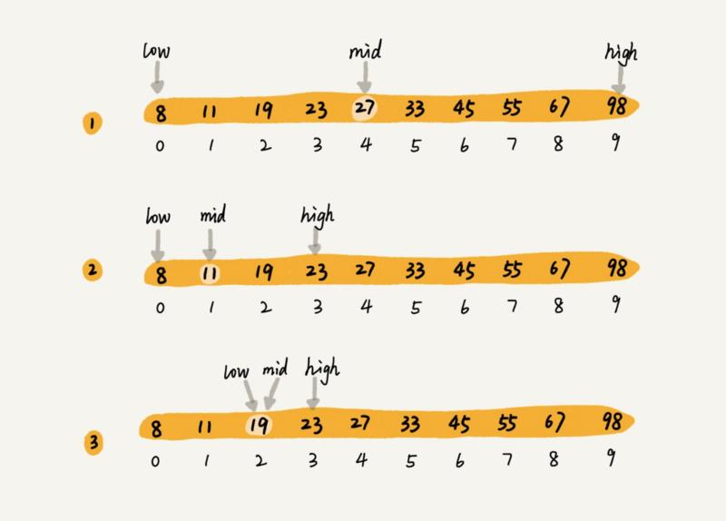

# 二分查找

二分查找，针对的是一个有序的数据集合（这点很重要），查找思想有点类似分治思想。每次都通过跟区间的中间元素对比，将待查找的区间缩小为之前的一半，直到找到要查找的元素，或者区间被缩小为 0。注意到二分查找针对的必须是已经排序过的有序数组，否则不能使用该算法。图示如下：



思路比较简单，我们将其通过 PHP 代码实现如下：

```php
<?php
    
function binary_search($nums, $num)
{
    return binary_search_internal($nums, $num, 0, count($nums) - 1);
}

function binary_search_internal($nums, $num, $low, $high)
{
    if ($low > $high) {
        return -1;
    }

    $mid = floor(($low + $high) / 2);
    if ($num > $nums[$mid]) {
        return binary_search_internal($nums, $num, $mid + 1, $high);
    } elseif ($num < $nums[$mid]) {
        return binary_search_internal($nums, $num, $low, $mid - 1);
    } else {
        return $mid;
    }
}

$nums = [1, 2, 3, 4, 5, 6];
$index = binary_search($nums, 5);
print $index;
```

很显然，二分查找的时间复杂度是 O(logn)。使用二分查找需要注意一个前提，那就是针对有序数组，换言之，二分查找适用于变动不是很频繁的静态序列集，如果序列集变动很频繁，经常进行插入删除操作，那么就要不断维护这个序列集的排序，这个成本也很高，因此，这种情况下就不适用二分查找了，比如我们的数据库查询，增删改查很频繁，显然不是通过二分查找来进行查询的。
