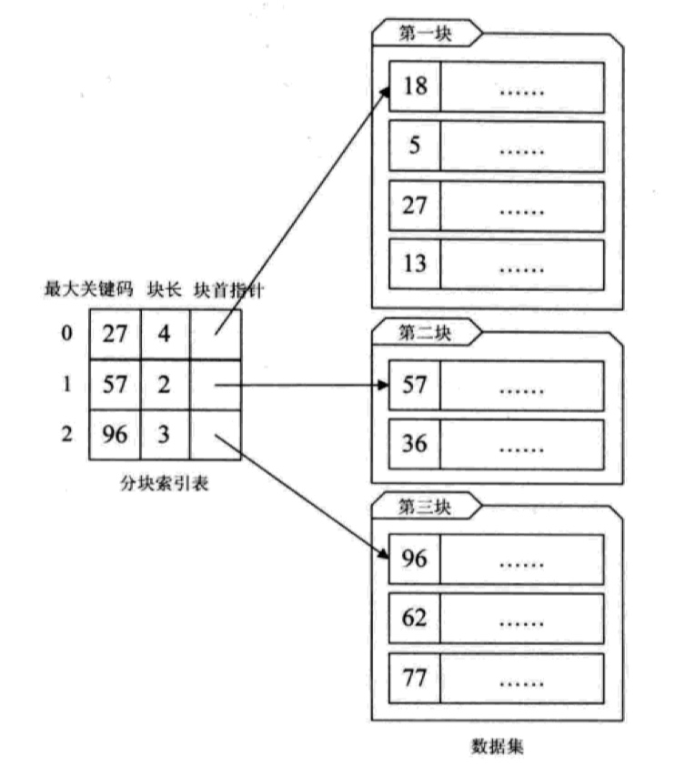

# 索引查找（二）：分块索引

为了减少索引项个数，我们对数据集进行分块，并使其分块有序，然后再给每个分块建立一个索引项（索引值是分块中最大关键码），至于分块内部，则不管其有序性，从而减少索引项的个数。在查找的时候在索引项中通过二分查找找到指定索引项，然后根据该索引项中的关键码去相应分块遍历查找指定元素，这是一种折中方案，既兼顾了空间复杂度，又兼顾了时间复杂度。

分块索引图示如下：

这里面有几个概念需要阐述下，首先是分块有序，需要满足两个先决条件：

1. 块内无序。即每一块内的记录不要求有序。当然，有序更理想，只不过要花费大量时间和空间的代价。
2. 块间有序。即要求后一块的所有关键字都大于前一块的所有关键字。只有块间有序，才能给查找带来效率。

其次，分块索引的索引项包含三个数据项：

1. 最大关键码：它存储每一块中的最大关键字。这样做的好处是在它之后的下一块中最小的关键字也能比这一块最大的关键字要大。
2. 块长：存储块中的记录个数，以便于循环时使用。
3. 块首指针：用于指向块首数据元素的指针，便于开始对这一块的记录开始遍历。

最后，在分块索引中查找，分两块进行：

1. 在分块索引表中查找要查找关键字所在的块。由于块间有序，所以可以通过二分查找快速定位（通过不小于给定值的第一个元素，不大于给定值的最后一个元素确定区间，以前面给出的示例图为例，58位于57和96之间，则会去第三块中查找）。
2. 根据块首指针找到相应的块，并在块中顺序查找指定值（即关键码，块中无序所以只能顺序查找）。

分块索引的时间复杂度是：O(log(m)+n)，其中 m 是分块数，n 是块内元素个数，在索引表长度和块内元素相等时，时间复杂度最优。性能要由于顺序查找，但是比二分查找要差。

总体来说，分块索引在兼顾存储空间和查找性能的情况下，被普遍用于数据库查找等技术中。
