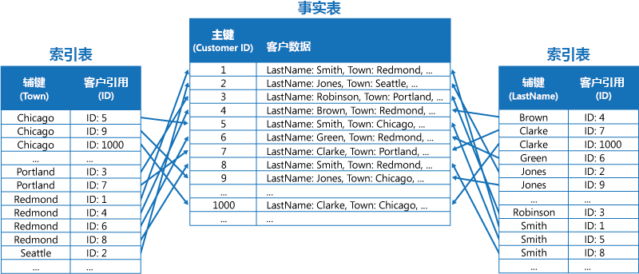
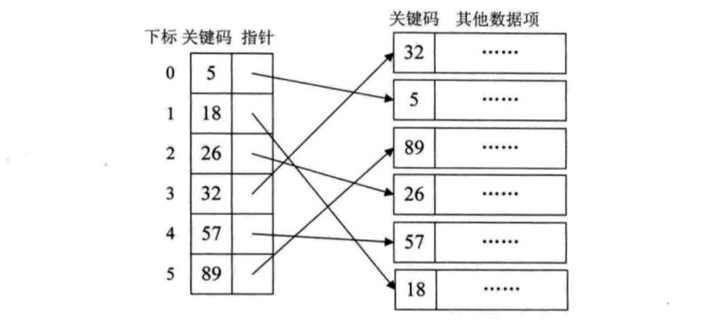

# 索引查找（一）：稠密索引

二分查找不适用于高速增长的海量数据，因为维护这个排序非常麻烦，所以我们引出索引这种数据结构。

索引是为了加快查找速度而设计的一种数据结构。索引就是把一个关键字与它对应的记录相关联的过程，一个索引由若干索引项构成，每个索引项至少包含关键字和其对应记录在存储器中的位置等信息。

由此可见，索引技术是组织大型数据库和磁盘文件的一种重要技术。

索引技术分为线性索引、树形索引和多级索引，这里我们只介绍线性索引。所谓线性索引就是将索引项集合组织为线性结构，也称索引表。以下是一个索引表的示例图：

在线性索引中，我们重点介绍三种：稠密索引、分块索引和倒排索引。

稠密索引是指在线性表中，将数据集中的每个记录对应一个索引项。就像我们上面示例图中的那样。以主键为例，可以将其抽象化如下：

对于稠密索引这个索引表来说，索引项一定按照关键码有序排列，这样可以应用二分查找，以免索引查找本身影响性能。可见，稠密索引性能可以做到和二分查找相当（找到对应关键码就可以通过指针直接指向对应记录），但是索引项长度和数据集一样长，空间复杂度高，如果数据太多需要存放到磁盘上，反复读取磁盘对性能影响很大。