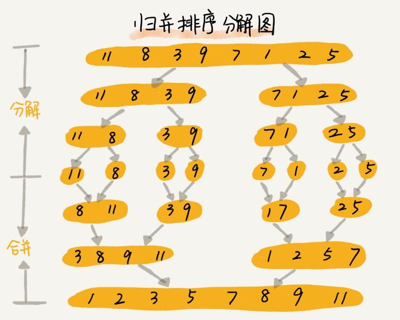

# 归并排序

归并排序，指的是如果要排序一个数组，我们先把数组从中间分成前后两部分，然后对前后两部分分别排序，再将排好序的两部分合并在一起，这样整个数组就都有序了。归并排序使用了分治思想，分治，顾名思义，就是分而治之，将一个大问题分解成小的子问题来解决。说到这里，可能你就能联想起我们之前讲到的一个编程技巧 —— 递归，没错，归并排序就是通过递归来实现的。这个递归的公式是每次都将传入的待排序数组一分为二，直到不能分割，然后将排序后序列合并，最终返回排序后的数组。原理图如下所示：



归并排序的 PHP 实现代码如下：

```php
<?php

function merge_sort($nums)
{
    if (count($nums) <= 1) {
        return  $nums;
    }

    merge_sort_c($nums, 0, count($nums) - 1);
    return $nums;
}

function merge_sort_c(&$nums, $p, $r)
{
    if ($p >= $r) {
        return;
    }

    $q = floor(($p + $r) / 2);
    merge_sort_c($nums, $p, $q);
    merge_sort_c($nums, $q + 1, $r);

    merge($nums, ['start' => $p, 'end' => $q], ['start' => $q + 1, 'end' => $r]);
}

function merge(&$nums, $nums_p, $nums_q)
{
    $temp = [];
    $i = $nums_p['start'];
    $j = $nums_q['start'];
    $k = 0;
    while ($i <= $nums_p['end'] && $j <= $nums_q['end']) {
        if ($nums[$i] <= $nums[$j]) {
            $temp[$k++] = $nums[$i++];
        } else {
            $temp[$k++] = $nums[$j++];
        }
    }

    if ($i <= $nums_p['end']) {
        for (; $i <= $nums_p['end']; $i++) {
            $temp[$k++] = $nums[$i];
        }
    }

    if ($j <= $nums_q['end']) {
        for (; $j <= $nums_q['end']; $j++) {
            $temp[$k++] = $nums[$j];
        }
    }

    for ($x = 0; $x < $k; $x++) {
        $nums[$nums_p['start'] + $x] = $temp[$x];
    }
}

$nums = [4, 5, 6, 3, 2, 1];
$nums = merge_sort($nums);
print_r($nums);
```

归并排序不涉及相等元素位置交换，是稳定的排序算法，时间复杂度是 O(nlogn)，要优于 O(n^2)，但是归并排序需要额外的空间存放排序数据，不是原地排序，最多需要和待排序数组同样大小的空间，所以空间复杂度是 O(n)。