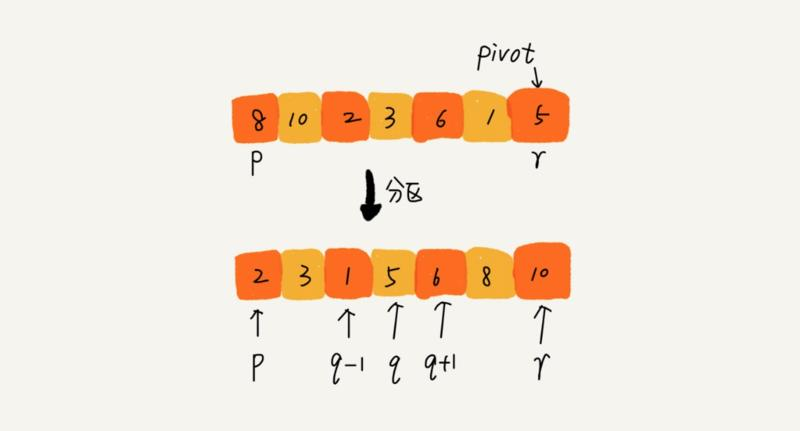

# 快速排序

归并排序算法虽好，但是不是原地排序算法，需要消耗额外的内存空间，今天我们要介绍的是常规排序里综合排名最高的排序算法：快速排序，江湖人称「快排」。

快排的核心思想是这样的：

> 如果要排序数组中下标从 p 到 r 之间的一组数据，我们选择 p 到 r 之间的任意一个数据作为 pivot（分区点）。

> 我们遍历 p 到 r 之间的数据，将小于 pivot 的放到左边，将大于 pivot 的放到右边，将 pivot 放到中间。经过这一步骤之后，数组 p 到 r 之间的数据就被分成了三个部分，前面 p 到 q-1 之间都是小于 pivot 的，中间是 pivot，后面的 q+1 到 r 之间是大于 pivot 的。

图示如下：



根据分治、递归的处理思想，我们可以用递归排序下标从 p 到 q-1 之间的数据和下标从 q+1 到 r 之间的数据，直到区间缩小为 1，就说明所有的数据都有序了，而且你可以看到我们不需要像归并排序那样做合并操作，也就不需要额外的内存空间，在算法复杂度和归并排序一样的情况下，有着更好的空间复杂度表现。

PHP 代码实现如下：

```php
<?php
    
function quick_sort($nums)
{
    if (count($nums) <= 1) {
        return $nums;
    }

    quick_sort_c($nums, 0, count($nums) - 1);
    return $nums;
}

function quick_sort_c(&$nums, $p, $r)
{
    if ($p >= $r) {
        return;
    }

    $q = partition($nums, $p, $r);
    quick_sort_c($nums, $p, $q - 1);
    quick_sort_c($nums, $q + 1, $r);
}

function partition(&$nums, $p, $r)
{
    $pivot = $nums[$r];
    $i = $p;
    for ($j = $p + 1; $j < $r; $j++) {
        // 原理：将比$pivot小的数丢到[$p...$i-1]中，剩下的[$i..$j]区间都是比$pivot大的
        if ($nums[$j] < $pivot) {
            $temp = $nums[$i];
            $nums[$i] = $nums[$j];
            $nums[$j] = $temp;
            $i++;
        }
    }

    // 最后将 $pivot 放到中间，并返回 $i
    $temp = $nums[$i];
    $nums[$i] = $pivot;
    $nums[$r] = $temp;

    return $i;
}

$nums = [4, 5, 6, 3, 2, 1];
$nums = quick_sort($nums);
print_r($nums);
```

正如我们前面所说的，快速排序是原地排序算法，时间复杂度和归并排序一样，也是 O(nlogn)，这个时间复杂度数据量越大，越优于 O(n^2)，但是快速排序也有其缺点，因为涉及到数据的交换，有可能破坏原来相等元素的位置排序，所以是不稳定的排序算法，尽管如此，凭借其良好的时间复杂度表现和空间复杂度的优势，快速排序在工程实践中应用较多，比如 PHP 数组的 sort 函数底层就是基于快速排序来实现的。